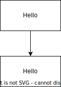

# 詳細設計書
- [詳細設計書](#詳細設計書)
  - [ドキュメント情報](#ドキュメント情報)
  - [処理フロー](#処理フロー)
  - [処理詳細](#処理詳細)
    - [入力チェック](#入力チェック)
    - [パスワード一致チェック](#パスワード一致チェック)

## ドキュメント情報
|機能ID|機能名|登録者|登録日|更新者|更新日|
|---|---|---|---|---|---|
|AUTH01|ログイン|Michiharu.T|2023/02/19|(初版)|(初版)|

## 処理フロー

## 処理詳細
### 入力チェック
|項目名|必須|文字列長|形式|
|---|---|---|---|
|ユーザーID|○|1~20|半角英数|
|パスワード|○|4~20|半角英数|

入力チェックエラー時は、下記メッセージIDを取得
* 必須エラー:valid.w01
* 文字列長エラー:valid.w03
### パスワード一致チェック
ユーザー情報.パスワードと画面IO.パスワードが不一致なら、エラーメッセージ(auth.w01)を表示